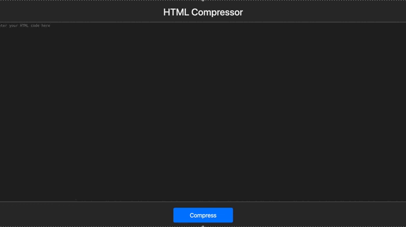

# HTML Compressor

A HTML compressor tool that removes unnecessary whitespace and compresses HTML code.

## Features

- Compresses HTML code by removing unnecessary whitespace from code
- Allows copying compressed code to the clipboard
- Supports undo and redo functionality via `Cmd/Ctrl+Z`
- Supports running the compress button click event via `Cmd/Ctrl+Enter`